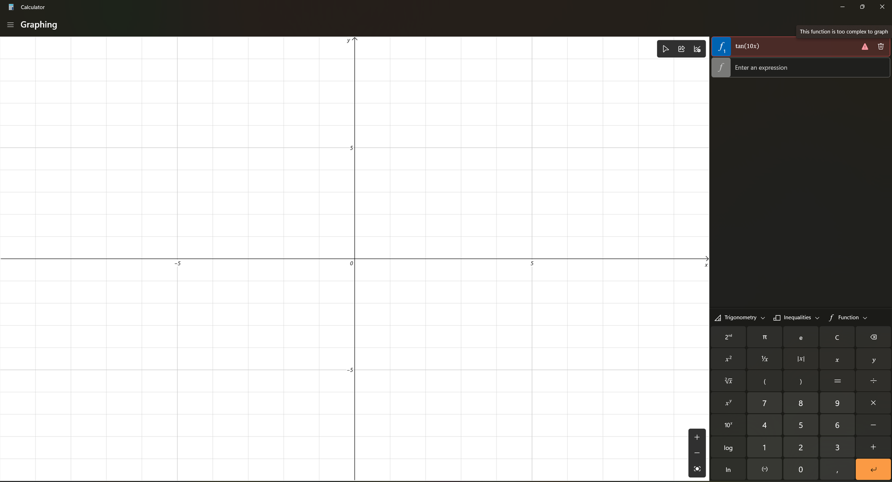
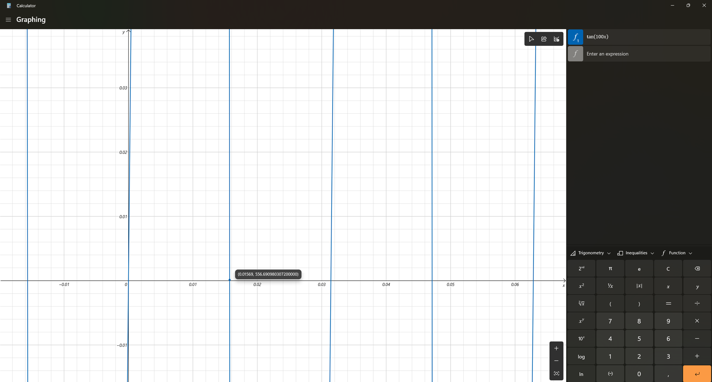
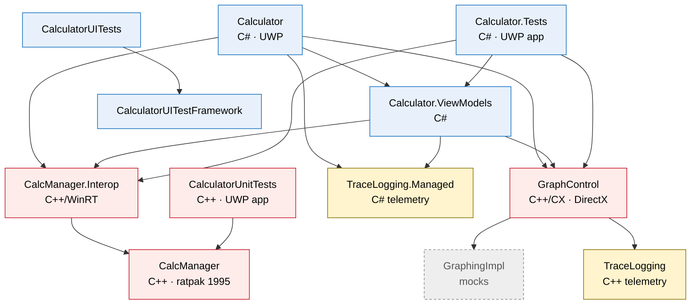

# Better than Legacy Calculator

**What is Microsoft's code actually worth, if with Claude you can rewrite their calculator from scratch in a day, the
calculator Microsoft hasn't been able to fix for years?**

This project is here to raise the problem of legacy software that would be cheaper and simpler to rewrite from scratch
than to keep dragging along a codebase from the Mesozoic. 90% of the code was written from scratch by Claude Opus 5.5,
using the interface of the legacy calculator as the reference, so don't take the code too seriously. The code in this
project is a measure of how much smaller and simpler a project gets once it lets go of its legacy. I'm not saying that
all the legacy in the world should be thrown away. MS Calculator is just a clear case where doing so would have been both
simpler and cheaper.

BTL Calculator is the answer to that question. It looks like the Windows calculator, it's more precise, it graphs what
the original refuses to graph, and it doesn't drag along DirectX, three dialects of C++, a pile of layers between them,
and libraries and practices from the last century just to draw a line. It's written in C# on Avalonia. The code was
written by Claude (Anthropic), directed by a person for whom a small corporation can't make a calculator that handles a
school formula: graphing `tan(10x)`.

[Русская версия](README.ru.md)

> *Better than Legacy.* I thought we'd hit rock bottom, and then someone knocked from below.

**I hope everyone who sees these decisions has a laugh and gets a boost to their self-esteem.**

<!-- Screenshots: docs/screenshots/*.png (standard, scientific, graphing with function analysis, currency, dark theme) -->

## How it started

I came across a video uploaded to YouTube five years ago, in which someone couldn't get the calculator to handle a very
simple formula, and I wondered whether the problem was still there.

### `tan(10x)`: this function is too complex

The app froze and stopped responding. On a computer with modern hardware (Ryzen 7 7700), the fans spun up as if a crypto
miner had started. The calculator thought for about five seconds and gave up:



> **This function is too complex to graph**

Graphing calculators have drawn this since the 90s, on processors many times weaker than today's microcontrollers.

### `tan(100x)`: drawing it the way I feel it

Here the original finally drew us a graph. But something is off:



- **Vertical lines where the function doesn't exist.** At x ≈ ±0.0157 and 0.047 the tangent goes to infinity, and the
  original simply connects +∞ to −∞ with a line across the whole screen.
- **The trace point sits on the x-axis**, and its label says **y = 556.69**. The number itself is right: tan(1.569) is
  indeed about 556.7. The point is just drawn where y is zero. The label and the point disagree, and the calculator is
  fine with that.

### So this is Microsoft's closed technology?

I wondered what exactly was wrong, so I decided to build the calculator from source. Maybe the version on my system was
old, and the new release on GitHub had fixed everything? Alas, after building and installing it, it turned out that the
graphing engine isn't in the "open" repository: `src/GraphingImpl/Mocks` holds its *mocks*, and the real one is closed.

Meanwhile, the closed engine can't handle a basic `tan(10x)`, lies when tracing `tan(100x)`, and its renderer used to
crash the whole app. What is so valuable in there that it has to be hidden remains a mystery.

*My personal opinion: the engine is kept closed so that nobody sees how many holes it has, and because it's used in other
products, so nobody has to bother closing potential vulnerabilities. But I won't claim that. Whether it's true or not
remains a mystery.*

## The obvious question

The calculator is a fairly simple program in Windows. Its code has been open since 2019, Microsoft employees work on it,
it has code review, CI and four test projects. And here's what's inside
([the original repository](https://github.com/microsoft/calculator), details below).

If this is the code Microsoft **isn't ashamed to show**, what does the code it hides look like?
It's no secret that Windows has millions of legacy components. I suspect many of them date back to MS-DOS and work in
much the same state as this calculator.

## Interim conclusions

Microsoft's latest commit is 4fd3fc5 of 25.08.2026, "Migrate Calculator ViewModels from C++ to C#" (#2491):
- 263 files changed: 22,362 lines added and 26,045 deleted, about 48,400 changed lines in total.

The calculator Claude wrote from scratch: 18,723 lines of code, with the tests and support for several platforms.

Many will object that comparing work by lines of code isn't fair, and out of context I'd even agree. But in context, it
seems to me that maintaining legacy like this takes more resources and skill from a developer: you have to work with two
languages and three dialects of C++, plus spend resources on maintaining the layer between this zoo of technologies.

## How not to write your calculator, by Microsoft's example

With examples from the Windows calculator. Every point can be checked in its repository; the full breakdown is in
[docs/HALL-OF-SHAME.md](docs/HALL-OF-SHAME.md).

**1. Write in every language at once.** The UI and ViewModels are in C#. The calculation engine (`CalcManager`) is in
plain C++. The bridge between them (`CalcManager.Interop`) is in C++/WinRT. The graph control (`GraphControl`) is in
C++/CX, the third kind of C++. Telemetry is in C++, and separately in C#. All of it is glued together with cross-language
interop, 12 projects in total. For a calculator.

This is how the projects of the original depend on each other (from their `ProjectReference`s):



**2. Build on a platform you've abandoned yourself.** The app is **UWP**
(`Microsoft.NETCore.UniversalWindowsPlatform`), which Microsoft itself has moved away from. The graphs are in **C++/CX**,
a Microsoft-only dialect of C++ that C++/WinRT replaced in 2016 (18 `ref class`es).
Meanwhile, the official site has a guide on moving from C++/CX to C++/WinRT. They'd better follow it themselves.

**3. For asynchrony, pick something older.** **PPL `concurrency::task`**, even in the C++ calculation engine, which
downloads the currency rates. That's how you said "do it later" in the Windows 8 era. Using this much legacy async
clearly doesn't do the components any good. My guess is that PPL is a big part of why the engine can't draw `tan(10x)`.

**4. Draw a line with DirectX.** The graph control is a renderer in C++ and DirectX (`GraphControl/DirectX`). Calling
native Windows APIs from a calculator is quite something.

**5. Have four test projects and make them apps.** `Calculator.Tests`, `CalculatorUnitTests`, `CalculatorUITests` and
`CalculatorUITestFramework`. Both *unit* test projects are UWP apps (`AppContainerExe` and `ApplicationType: Windows
Store`). To test that 2 + 2 = 4, you build and deploy an app. The graphing engine isn't tested, because it isn't there.

**6. Count which buttons the user presses.** Two whole telemetry projects (`TraceLogging` and `TraceLogging.Managed`,
20 kinds of events), and among the events is `ButtonUsageInSession`: every press of every little button gets processed
and possibly sent to Microsoft's servers, because it's so important to know what the user is calculating.

**7. Spread it thin.** About **77,000 lines** of C++, C# and XAML, *not counting* the closed engine.

And now the same for us:

| | Original | BTL Calculator |
|---|---|---|
| Languages | C#, C++, C++/CX, C++/WinRT | C# |
| Projects | 12 | 4 and tests |
| Platform | UWP, Windows only | .NET 10 and Avalonia: Windows, Linux, macOS, Android |
| Graphs | DirectX and a closed engine | A control that draws with Avalonia, and an open engine with tests |
| Tests | 4 projects; the unit tests are UWP apps | 249 tests of the core and 36 of the UI (it runs without a window); `dotnet test` on any OS |
| Telemetry | 2 projects | None. [PRIVACY.md](PRIVACY.md) is shorter than this table |
| `tan(10x)` | "Too complex to graph" after 5 s | 11 ms |
| Size | ≈ 77,000 lines without the engine | 18,723 lines with the engine and the tests |

And after all that, it's just a calculator. Yes, writing a good calculator isn't easy. But at its core it takes numbers
and gives numbers back. It doesn't need four languages, a graphics API, a telemetry pipeline and a C++ dialect from the
Windows 8 era. So we rewrote it.

### Bonus round: even Microsoft's cross-platform framework

The first version of this calculator was written on .NET MAUI, the cross-platform UI framework of Microsoft itself.
It runs on Windows, macOS, Android and iOS. Linux, the system of most servers and a good share of developers, is not
on the list: there is only an experimental GTK backend in a labs repository. On it, gestures were never connected,
the layout was computed for the window with its title bar and cut the bottom off, and every style property of a button
overwrote the previous one. It took a dozen workarounds to get a calculator to show up, and it still froze.

So the calculator moved to [Avalonia](https://avaloniaui.net), an open-source framework from a small team. It ran on
Linux the first time, as a single Native AOT binary, with no workarounds at all. Unlike MAUI, Avalonia doesn't pull in
GTK: it renders with Skia, a modern, fast cross-platform graphics library. The same code runs on Windows, macOS and
Android.

## Features

- **A complete** implementation of the features, in a very similar interface.
- **Standard, scientific and programmer modes** with the familiar layout and keyboard shortcuts.
- **Exact arithmetic** with arbitrary-precision decimals (40 significant digits internally). Angles in degrees are exact
  (sin 30° is exactly 0.5), and there is a gamma function for factorials of non-integers.
- **Programmer mode**: QWORD/DWORD/WORD/BYTE, two's complement, HEX/DEC/OCT/BIN, bitwise operations, shifts and
  rotations, and a keypad to flip bits.
- **Graphing** on its own engine, which draws `tan(10x)` (sorry, we couldn't resist):
  - explicit and implicit curves, inequalities, and parameters with sliders;
  - adaptive sampling that follows steep parts and detects jumps. Interval arithmetic draws sub-pixel oscillation the
    way it is, not as random spikes;
  - **function analysis**, including periodic functions: domain, range, intercepts, extrema, inflection points,
    asymptotes, parity, period and monotonicity. `tan(x)` gives `x ≠ πn₁ + π/2; ∀n₁ ∈ ℤ`;
  - tracing with the mouse or the arrow keys, where the dot and the label agree. Every drawn segment stays within a
    pixel of the function (there are tests for that);
  - sharing a picture of the graph through the share sheet of the system (Windows, Android), or saving it;
  - curves computed off the UI thread with an overscan margin, so panning is smooth and nothing heats up.
- **Date calculation**: the difference between dates, adding and subtracting years, months and days.
- **13 converters**, including **currency**, with rates from the free
  [ExchangeRate-API](https://www.exchangerate-api.com) (cached for offline use).
- **7 languages**: English, Russian, Chinese (Simplified), Hindi, Spanish, Arabic (right to left) and French. Plural
  forms are correct, and the language switches in the settings without a restart.
- **Windows 11 look** everywhere: the keys, colors and fonts of the original, light and dark themes, the Mica window
  material on Windows 11, short Fluent transitions, and a compact "keep on top" window. We kept the pretty parts.

## Platforms

| Platform | Status |
|---|---|
| Windows 10/11 | Main platform, used daily. Mica window material, the system share sheet |
| Linux (X11) | One Native AOT binary, x64 and arm64; the look is the same |
| macOS | CI builds it and runs the tests on macOS. I don't have a Mac, so I can't test it :( |
| Android | Works, tested on a phone: the back gesture, pinch zoom, the system share sheet |
| iOS | I guess whoever wants it will build it, but I don't have a Mac :( |

## Download

Ready builds are on the [Releases](../../releases/latest) page:

| File | For |
|---|---|
| `BtlCalculator-<version>-win-x64.zip`, `-win-arm64.zip` | Windows 10/11: unpack and run `BtlCalculator.exe` |
| `BtlCalculator-<version>-linux-x64.tar.gz`, `-linux-arm64.tar.gz` | Linux: unpack and run `./BtlCalculator` |
| `BtlCalculator-<version>-android.apk` | Android 7.0 and newer: open the file on the phone and allow the install |

## Building

Requirements: the [.NET 10 SDK](https://dotnet.microsoft.com/download). No MSBuild as a separate build system.

```bash
# Windows, Linux, macOS
dotnet run --project src/Calculator.Desktop

# One self-contained binary (Native AOT; build on the target system: Windows needs the C++ build tools of Visual
# Studio, Linux needs clang)
dotnet publish src/Calculator.Desktop -c Release -r linux-x64 -o out

# Tests of the math core and of the user interface (any OS, the UI tests run without a window)
dotnet test tests/Calculator.Core.Tests
dotnet test tests/Calculator.UI.Tests

# Android APK (once: dotnet workload install android; also the Android SDK and a JDK, e.g. from Android Studio)
dotnet publish src/Calculator.Android -c Release
adb install -r src/Calculator.Android/bin/Release/net10.0-android/publish/com.btlcalculator.app-Signed.apk
```

### CI

GitHub Actions (`.github/workflows`):

- **CI** builds the desktop app and runs every test on Windows, Linux and macOS, and builds the Android APK (the APK
  of each run is in its Artifacts);
- **Release** runs on a version tag (`git tag v0.2.0 && git push origin v0.2.0`): it builds the Native AOT binaries for
  Windows and Linux (x64 and arm64) and the APK, and publishes them as a GitHub release. The APK is signed with the
  release key from the repository secrets (`ANDROID_KEYSTORE`, `ANDROID_KEYSTORE_PASSWORD`, `ANDROID_KEY_ALIAS`,
  `ANDROID_KEY_PASSWORD`), or with a debug key when there are none.

## Project structure

```
src/Calculator.Core      the math: numbers, engines, converters, graphing. No UI, fully tested, not a mock
src/Calculator.UI        the user interface on Avalonia, shared by every platform: views, view models, graph drawing,
                         localization (7 languages), styles
src/Calculator.Desktop   Windows, Linux and macOS app
src/Calculator.Android   Android app
tests/                   tests of the core (xUnit) and of the UI (Avalonia headless, with screenshots of every mode)
tools/                   scripts that refresh data files (currency names)
docs/images/             evidence
docs/HALL-OF-SHAME.md    how not to write a calculator: every flaw of the original, explained
```

## Contributing

Issues and pull requests are welcome. Found a function we can't graph? Open an issue. Unlike some, we'll fix it and
merge it.

Translations are especially welcome: the Hindi, Chinese and Arabic texts were written without a native speaker and would
benefit from one. Strings live in `src/Calculator.UI/Resources/Strings/Strings.*.resx`.

## Support the author

If you liked this and find it useful, you can leave me a donation:
- USDT Ton: UQD4OjiKEpHUsM2ssZMzC21X3xwkMqRUNOyj66qigxg1Eb6M
- USDT Trc20: TWJPz26hsh2h55Lm3QHdtgUBWZYLhCTXcm

## Bonus: the hall of shame

I asked Claude to go through what I had seen in the source code and to add some finds of its own, for those who want a
laugh. Exhibits from [microsoft/calculator](https://github.com/microsoft/calculator) (MIT) for those who read this far.
All verbatim, no editing, with file paths so you can check.

| # | Exhibit | Where |
|---|---|---|
| 1 | enum → int → enum | `GraphControl`, `Calculator.ViewModels`, `Calculator.Tests` |
| 2 | Six kinds of "too complex" | `GraphControl/Models/Equation.h` |
| 3 | A catch that never catches | `CalcManager/CalculatorVector.h` |
| 4 | 1995 math on macros | `CalcManager/Ratpack` |
| 5 | Calculator bugs live in the OS tracker | `Calculator/Views` |
| 6 | Leftover TODOs from Visual Studio templates | `GraphControl/DirectX`, `CalculatorUnitTests` |

### 1. enum → int → enum

The graphs have proper enums, `ErrorType` and `EvaluationErrorCode`. The graph control stores them… in `int`s. The
ViewModel receives an `int` and uses the error type to decide which enum to turn it back into. And the test dutifully
turns the enum into an `int` so that the method can turn it back.

<table>
<tr><th>Original</th><th>BTL Calculator</th></tr>
<tr><td>

```cpp
// GraphControl/Control/Grapher.h
int m_errorType;
int m_errorCode;
```

```csharp
// Calculator.ViewModels/.../EquationViewModel.cs
public static string EquationErrorText(
    GraphControl.ErrorType errorType, int errorCode)
{
    if (errorType == GraphControl.ErrorType.Evaluation)
    {
        switch ((GraphControl.EvaluationErrorCode)errorCode)
```

```csharp
// Calculator.Tests/GraphingViewModelTests.cs
EquationViewModel.EquationErrorText(
    GraphControl.ErrorType.Evaluation,
    (int)GraphControl.EvaluationErrorCode.Overflow));
```

</td><td>

```csharp
// Calculator.Core/Graphing/GraphParser.cs
public sealed class GraphInputException(GraphInputError error)
    : Exception($"Invalid graph input: {error}.")
{
    public GraphInputError Error { get; } = error;
}
```

```csharp
throw new GraphInputException(
    GraphInputError.EqualWithoutGraphVariable);
```

The error is an enum. From start to finish.

</td></tr>
</table>

### 2. Six kinds of "too complex"

From the same `switch`:

| Code | Value | What the user sees |
|---|---:|---|
| `TooComplexToSolve` | 4 | "Too complex" |
| `EquationTooComplexToSolveSymbolic` | −7 | "Too complex" |
| `EquationTooComplexToSolve` | −9 | "Too complex" |
| `EquationTooComplexToPlot` | −10 | "Too complex" |
| `InequalityTooComplexToSolve` | −41 | "Too complex" |
| `GE_TooComplexToSolve` | −506 | "Too complex" |

Six ways to give up and one message. Judging by `tan(10x)`, it's the busiest path in the code.

### 3. A catch that never catches

A `std::vector`, wrapped in COM-style error codes:

```cpp
// CalcManager/CalculatorVector.h
ResultCode SetAt(_In_ unsigned int index, _In_opt_ TType item)
{
    try
    {
        m_vector[index] = item;          // operator[] checks nothing
    }
    catch (const std::out_of_range& /*ex*/)
    {
        return E_BOUNDS;                 // unreachable
    }
    return S_OK;
}
```

`operator[]` doesn't check bounds and never throws `out_of_range`. An index out of range isn't `E_BOUNDS`, it's
undefined behaviour. But hey, there's a `try`.

### 4. 1995 math on macros

The heart of the calculator is `ratpak`, a rational number library. The file header speaks for itself:

```cpp
// CalcManager/Ratpack/ratpak.h
//  Package Title  ratpak
//  File           ratpak.h
//  Copyright      (C) 1995-99 Microsoft
//  Date           01-16-95
```

Memory is managed by hand, with **233** calls to `destroyrat`/`destroynum` across the engine. Copying a number is a
four-statement macro:

```cpp
#define DUPRAT(a, b)            \
    destroyrat(a);              \
    createrat(a);               \
    DUPNUM((a)->pp, (b)->pp);   \
    DUPNUM((a)->pq, (b)->pq);
```

There's no `do { } while (0)`. Write `if (x) DUPRAT(a, b);` and only the first line is under the `if`: the number is
destroyed conditionally, and the other three lines always run. It's a first-year classic, and it has been in production
since 1995.

And here it is in action, computing an arcsine:

```cpp
// CalcManager/Ratpack/itrans.cpp
PRAT phack = nullptr;
...
// Avoid the really bad part of the asin curve near +/-1.
DUPRAT(phack, *px);
```

The variable is called `phack`, and the comment says to avoid "the really bad part of the curve". No further comment.

### 5. Calculator bugs live in the OS tracker

```csharp
// Calculator/Views/MainPage.xaml.cs
// FIXME: https://microsoft.visualstudio.com/DefaultCollection/OS/_workitems/edit/47775705/
TraceLogger.GetInstance().LogRecallError("55e29ba5-6097-40ec-8960-458750be3039");
```

The open-source code has a link to a **private** internal tracker, in the **OS** project. Instead of a fix, a hard-coded
GUID goes to telemetry. Remember the question about the operating system's code? Well, they share bugs.

```csharp
// Calculator/Views/DateCalculator.xaml.cs
// We choose 2550 as the max year because CalendarDatePicker experiences clipping
// issues just after 2558.  We would like 9999 but will need to wait for a platform
// fix before we use a higher max year.  This platform issue is tracked by
// TODO: MSFT-9273247
private const int c_maxYear = 2550;
```

The date calculator can't go past the year 2550, because Microsoft's **own** date picker gets clipped after 2558. The
calculator is waiting for a platform fix. The platform is also Microsoft.

```csharp
// Calculator/App.xaml.cs
// TODO: MSFT 14645325: Set this directly from XAML.
// Currently this is bugged so the property is only respected from code-behind.
```

One more bug in their own XAML, worked around in code.

### 6. Leftover TODOs from Visual Studio templates

```cpp
// GraphControl/DirectX/RenderMain.cpp
// TODO: Replace this with the sizedependent initialization of your app's content.
```

```cpp
// CalculatorUnitTests/UnitTestApp.xaml.cpp
// TODO: Save application state and stop any background activity
```

These aren't the developers' own notes. They're text from Visual Studio project templates (a DirectX app and a blank UWP
app). The Windows calculator's graph renderer started as "File → New Project", and nobody ever replaced the placeholder.

**The full list, with the context of each decision and twelve more exhibits: [docs/HALL-OF-SHAME.md](docs/HALL-OF-SHAME.md).**

---

*Not affiliated with, endorsed by or sponsored by Microsoft. "Windows" and "Microsoft" are trademarks of Microsoft
Corporation, used here only to say what this project is an alternative to. The screenshots of the original calculator
are shown to document its behaviour. The code snippets are quoted from
[microsoft/calculator](https://github.com/microsoft/calculator) under the MIT License. The facts refer to its public
code; the conclusions, questions and jokes are the author's.*

## License

[MIT](LICENSE). Third-party components and data are listed in [THIRD-PARTY-NOTICES.md](THIRD-PARTY-NOTICES.md).
The app does not collect any data: see [PRIVACY.md](PRIVACY.md).
