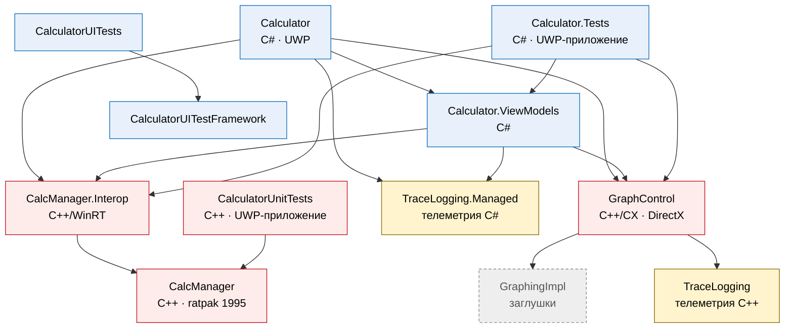

# Better than Legacy Calculator

**Сколько на самом деле стоит код Microsoft, если с помощью Claude за день с нуля можно переписать их калькулятор, который Microsoft не
может починить уже много лет?**

Этот проект призван поднять проблему легаси-решений, которые было бы дешевле и проще переписать с нуля, чем тянуть
кодовую базу с мезозоя. 90% кода было переписано с нуля Claude Opus 5.5 с опорой на интерфейс легаси-калькулятора,
поэтому не стоит относиться к коду серьёзно. Код в этом проекте - мера того, насколько меньше и проще будет проект при
отказе от легаси. Но я не утверждаю, что от всего легаси в мире нужно отказываться, просто MS Calculator - явный пример,
когда это сделать было и проще, и дешевле.

BTL Calculator - это ответ на этот вопрос. Выглядит как калькулятор Windows, считает точнее, строит то, что оригинал
строить отказывается, и не тащит с собой DirectX, 3 диалекта C++, кучу прослоек между ними, библиотеки и методики из
прошлого века ради того, чтобы нарисовать линию. Написан на C# и Avalonia. Код писал Claude (Anthropic), а руководил
человек, которому маленькая корпорация не может сделать калькулятор, который посчитает школьную формулу - построит
`tan(10x)`.

[English version](README.md)

> *Better than Legacy.* Я думал, дно достигнуто, но снизу постучали.

**Надеюсь, каждый, кто увидит эти решения, посмеётся и поднимет себе самооценку.**

<!-- Скриншоты: docs/screenshots/*.png (обычный, инженерный, графики с анализом функции, валюты, тёмная тема) -->

## С чего всё началось

Я увидел в сети видео, выложенное на YouTube 5 лет назад: человек не может посчитать в калькуляторе простейшую
формулу. Мне стало интересно, есть ли эта проблема до сих пор.

### `tan(10x)` - эта функция слишком сложна

Приложение зависло и не реагировало. На компьютере с современным железом (Ryzen 7 7700) начали шуметь вертушки, как при
запуске майнера. Калькулятор подумал около пяти секунд и сдался:


> **This function is too complex to graph** - «Эта функция слишком сложна для построения»

Графические калькуляторы рисуют такое с 90-х на процессорах кратно слабее, чем современные микроконтроллеры.

### `tan(100x)` - рисую как чувствую

Здесь оригинал наконец-то нарисовал нам график. Но что-то здесь не так:


- **Вертикальные линии там, где функции нет.** При x ≈ ±0,0157 и 0,047 тангенс уходит в бесконечность, а оригинал
  просто соединяет +∞ с −∞ линией через весь экран.
- **Точка трассировки лежит на оси x**, а подпись к ней гласит **y = 556,69**. Само число верное: tan(1,569)
  действительно около 556,7. Только нарисована точка там, где y равен нулю. Подпись и точка не согласны друг с другом,
  и калькулятора это устраивает.

### И это всё закрытые технологии Microsoft?

Мне стало интересно, что, собственно, не так, и я решил собрать калькулятор из исходников. Может, у меня в системе
старая версия, а новый релиз на GitHub всё починил? Но, увы, после сборки и установки оказалось, что движка графиков нет
в «открытом» репозитории: в `src/GraphingImpl/Mocks` лежат его *заглушки*, а настоящий закрыт.

При этом закрытый движок не справляется с банальным `tan(10x)`, врёт при трассировке `tan(100x)`, а его рендер
ещё и ронял приложение целиком. Что именно там такого ценного, что это нужно прятать, остаётся загадкой.

*Моё личное мнение: движок держат закрытым, чтобы никто не увидел, сколько в нём дыр, а ещё он используется в других
продуктах - так не нужно возиться с закрытием потенциальных уязвимостей. Но утверждать не буду. Правда это или нет,
остаётся загадкой.*

## Вопрос, который напрашивается сам

Калькулятор - довольно простая программа в Windows. Его код открыт с 2019 года, над ним работают сотрудники Microsoft,
у него есть ревью, CI и четыре проекта тестов. И вот что внутри
([в оригинальном репозитории](https://github.com/microsoft/calculator), подробности ниже).

Если так выглядит код, который Microsoft **не стесняется показать**, как выглядит код, который она скрывает?
Не секрет, что в Windows миллионы легаси-компонентов. Думаю, что многие из них остались ещё с MS-DOS и работают в таком
же состоянии, как и этот калькулятор.

## Промежуточные выводы

Последний коммит Microsoft - 4fd3fc5 от 25.08.2026, «Migrate Calculator ViewModels from C++ to C#» (#2491):
- затронуто 263 файла: добавлено 22 362 строки, удалено 26 045, всего около 48 400 изменённых строк.

Калькулятор, написанный Claude с нуля: 18 723 строки кода вместе с тестами и поддержкой нескольких платформ.

Многие могут возразить, что некорректно сравнивать работу количеством написанных строк кода, и я бы даже согласился с
этим утверждением вне контекста. Но если учитывать контекст, то, как мне кажется, поддержка такого легаси требует от
разработчика больше ресурсов и компетенций: приходится работать с 2 языками и 3 диалектами C++, а ещё направлять
ресурсы на поддержку слоя между этим зоопарком технологий.

## Как не стоит писать свой калькулятор: пример от Microsoft

С примерами из калькулятора Windows. Каждый пункт проверяется в его репозитории, полный разбор - в
[docs/HALL-OF-SHAME.ru.md](docs/HALL-OF-SHAME.ru.md).

**1. Пишите на всех языках сразу.** Интерфейс и ViewModel на C#. Движок вычислений (`CalcManager`) на обычном C++.
Мост между ними (`CalcManager.Interop`) на C++/WinRT. Элемент графиков (`GraphControl`) на C++/CX, это третий вид C++.
Телеметрия на C++ и отдельно на C#. Всё это склеено межъязыковым interop, в сумме 12 проектов. Для калькулятора.

Так выглядят зависимости проектов оригинала (по их `ProjectReference`):



**2. Стройте на платформе, от которой сами же отказались.** Приложение на **UWP**
(`Microsoft.NETCore.UniversalWindowsPlatform`), от которой ушла сама Microsoft. Графики на **C++/CX**, диалекте C++
только для Microsoft, который в 2016 году заменил C++/WinRT (18 `ref class`).
При этом на официальном сайте есть рекомендация по переходу с C++/CX на C++/WinRT. Лучше бы сами ей следовали.

**3. Для асинхронности берите что постарше.** **PPL `concurrency::task`**, даже в движке вычислений на C++, который
загружает курсы валют. Это способ сказать «сделай потом» из эпохи Windows 8. Обширное использование легаси-асинхронности
явно не лучшим образом сказывается на компонентах. Предполагаю, что PPL - большая часть причин, по которым движок не может
отрисовать `tan(10x)`.

**4. Рисуйте линию через DirectX.** Элемент графиков - это рендерер на C++ и DirectX (`GraphControl/DirectX`). Вызов нативных API Windows в калькуляторе - это очень сильно.

**5. Заведите четыре проекта тестов и сделайте их приложениями.** `Calculator.Tests`, `CalculatorUnitTests`,
`CalculatorUITests` и `CalculatorUITestFramework`. Оба проекта *юнит*-тестов - это UWP-приложения (`AppContainerExe` и
`ApplicationType: Windows Store`). Чтобы проверить, что 2 + 2 = 4, нужно собрать и развернуть приложение. Движок графиков
при этом не тестируется: его нет.

**6. Считайте, какие кнопки нажимает пользователь.** Два целых проекта телеметрии (`TraceLogging` и
`TraceLogging.Managed`, 20 видов событий), и среди событий `ButtonUsageInSession`: нажатие каждой кнопочки будет обрабатываться и, возможно, передаваться на серверы Microsoft, ведь так необходимо знать, что считает пользователь.

**7. Размазывайте.** Около **77 000 строк** C++, C# и XAML, *не считая* закрытого движка.

А теперь то же самое у нас:

| | Оригинал | BTL Calculator |
|---|---|---|
| Языки | C#, C++, C++/CX, C++/WinRT | C# |
| Проекты | 12 | 4 и тесты |
| Платформа | UWP, только Windows | .NET 10 и Avalonia: Windows, Linux, macOS, Android |
| Графики | DirectX и закрытый движок | Элемент, рисующий средствами Avalonia, и открытый движок с тестами |
| Тесты | 4 проекта, юнит-тесты - UWP-приложения | 249 тестов ядра и 37 тестов интерфейса (он работает без окна); `dotnet test` на любой ОС |
| Телеметрия | 2 проекта | Нет. [PRIVACY.md](PRIVACY.md) короче этой таблицы |
| `tan(10x)` | «Too complex to graph» через 5 с | 11 мс |
| Размер | ≈ 77 000 строк без движка | 18 723 строки с движком и тестами |

При всём этом это просто калькулятор. Да, написать хороший калькулятор непросто. Но по сути он принимает числа и отдаёт числа. Ему не нужны четыре языка,
графический API, конвейер телеметрии и диалект C++ времён Windows 8. Мы и переписали.

### Бонус: даже кроссплатформенный фреймворк Microsoft

Первая версия этого калькулятора была написана на .NET MAUI - кроссплатформенном фреймворке самой Microsoft. Он
работает на Windows, macOS, Android и iOS. Linux, системы большинства серверов и заметной доли разработчиков, в
списке нет: есть только экспериментальный бэкенд на GTK в «лабораторном» репозитории. На нём жесты вообще не
подключались, раскладка считалась по окну вместе с заголовком и обрезала низ, а каждое свойство стиля кнопки затирало
предыдущее. Чтобы калькулятор хотя бы появился, понадобился десяток обходов, и он всё равно зависал.

Поэтому калькулятор переехал на [Avalonia](https://avaloniaui.net) - открытый фреймворк небольшой команды. На Linux он
заработал с первого раза, одним бинарником Native AOT и без единого обхода. В отличие от MAUI, Avalonia не тянет GTK, а использует для рендеринга современную быструю
кроссплатформенную библиотеку - Skia. Тот же код работает на Windows, macOS и Android.

## Возможности

- **Полная** реализация функционала в очень похожем интерфейсе.
- **Обычный, инженерный и программистский режимы** с привычной раскладкой и сочетаниями клавиш.
- **Точная арифметика**: десятичные числа произвольной точности (внутри 40 значащих цифр). Углы в градусах точные
  (sin 30° - ровно 0,5), есть гамма-функция для факториала нецелых чисел.
- **Режим программиста**: QWORD/DWORD/WORD/BYTE, дополнительный код, HEX/DEC/OCT/BIN, побитовые операции, сдвиги и
  циклические сдвиги, клавиатура для переключения битов.
- **Графики** на собственном движке, который рисует `tan(10x)` (простите, не удержались):
  - явные и неявные кривые, неравенства, параметры с ползунками;
  - адаптивная выборка, которая следит за крутыми участками и находит разрывы. Интервальная арифметика рисует
    колебания мельче пикселя такими, какие они есть, а не случайными пиками;
  - **анализ функции**, включая периодические: область определения, область значений, пересечения с осями, экстремумы,
    точки перегиба, асимптоты, чётность, период, монотонность. Для `tan(x)` результат `x ≠ πn₁ + π/2; ∀n₁ ∈ ℤ`;
  - трассировка мышью или стрелками, где точка и подпись согласны друг с другом. Каждый нарисованный отрезок лежит
    не дальше пикселя от функции (на это есть тесты);
  - картинкой графика можно поделиться через системное «Поделиться» (Windows, Android) или сохранить её;
  - кривые считаются вне потока интерфейса и с запасом за краями экрана, поэтому перемещение плавное и ничего не
    греется.
- **Вычисление дат**: разница между датами, прибавление и вычитание лет, месяцев и дней.
- **13 конвертеров**, включая **валюты**, с курсами из бесплатного
  [ExchangeRate-API](https://www.exchangerate-api.com) (с кэшем для работы без сети).
- **7 языков**: английский, русский, китайский (упрощённый), хинди, испанский, арабский (справа налево) и французский.
  Формы множественного числа правильные, язык переключается в настройках без перезапуска.
- **Вид Windows 11** на всех системах: клавиши, цвета и шрифты оригинала, светлая и тёмная темы, материал окна Mica
  на Windows 11, короткие переходы Fluent и компактное окно «поверх всех окон». Красивое мы оставили.

## Платформы

| Платформа | Состояние                                                                                    |
|---|----------------------------------------------------------------------------------------------|
| Windows 10/11 | Основная платформа, используется каждый день. Материал окна Mica, системное «Поделиться»     |
| Linux (X11) | Один бинарник Native AOT, x64 и arm64; выглядит так же                                       |
| macOS | CI собирает его и прогоняет тесты на macOS; у меня нет мака, так что я не могу протестировать ( |
| Android | Работает, проверен на телефоне: жест «Назад», масштаб двумя пальцами, системное «Поделиться» |
| iOS | Думаю, что кто захочет, тот и соберёт, но у меня нет мака (                                  |


## Скачать

Готовые сборки лежат на странице [Releases](../../releases/latest):

| Файл | Для чего |
|---|---|
| `BtlCalculator-<версия>-win-x64.zip`, `-win-arm64.zip` | Windows 10/11: распаковать и запустить `BtlCalculator.exe` |
| `BtlCalculator-<версия>-linux-x64.tar.gz`, `-linux-arm64.tar.gz` | Linux: распаковать и запустить `./BtlCalculator` |
| `BtlCalculator-<версия>-android.apk` | Android 7.0 и новее: открыть файл на телефоне и разрешить установку |

## Сборка

Нужен [.NET 10 SDK](https://dotnet.microsoft.com/download). Без MSBuild как отдельной системы сборки.

```bash
# Windows, Linux, macOS
dotnet run --project src/Calculator.Desktop

# Один самостоятельный бинарник (Native AOT; собирать на целевой системе: для Windows нужны инструменты сборки C++
# из Visual Studio, для Linux - clang)
dotnet publish src/Calculator.Desktop -c Release -r linux-x64 -o out

# Тесты математического ядра и интерфейса (любая ОС, тесты интерфейса работают без окна)
dotnet test tests/Calculator.Core.Tests
dotnet test tests/Calculator.UI.Tests

# APK для Android (один раз: dotnet workload install android; ещё Android SDK и JDK, например из Android Studio)
dotnet publish src/Calculator.Android -c Release
adb install -r src/Calculator.Android/bin/Release/net10.0-android/publish/com.btlcalculator.app-Signed.apk
```

### CI

GitHub Actions (`.github/workflows`):

- **CI** собирает настольное приложение и прогоняет все тесты на Windows, Linux и macOS, а ещё собирает APK для
  Android (APK каждого запуска лежит в его Artifacts);
- **Release** запускается по тегу версии (`git tag v0.2.0 && git push origin v0.2.0`): собирает бинарники Native AOT
  для Windows и Linux (x64 и arm64) и APK и публикует их релизом на GitHub. APK подписывается ключом из секретов
  репозитория (`ANDROID_KEYSTORE`, `ANDROID_KEYSTORE_PASSWORD`, `ANDROID_KEY_ALIAS`, `ANDROID_KEY_PASSWORD`), а если их
  нет - отладочным ключом.

## Структура проекта

```
src/Calculator.Core      математика: числа, движки, конвертеры, графики. Без UI, полностью покрыта тестами, не заглушка
src/Calculator.UI        интерфейс на Avalonia, общий для всех платформ: виды, модели, рисование графиков,
                         локализация (7 языков), стили
src/Calculator.Desktop   приложение для Windows, Linux и macOS
src/Calculator.Android   приложение для Android
tests/                   тесты ядра (xUnit) и интерфейса (Avalonia без окна, со скриншотами всех режимов)
tools/                   скрипты обновления файлов данных (названия валют)
docs/images/             улики
docs/HALL-OF-SHAME.ru.md как не надо писать калькулятор: все огрехи оригинала с разбором
```

## Участие

Issues и pull requests приветствуются. Нашли функцию, которую мы не можем построить? Откройте issue. В отличие от
некоторых, мы починим и примем.

Особенно приветствуются переводы: тексты на хинди, китайском и арабском писались без носителя языка, и им не помешает
его взгляд. Строки лежат в `src/Calculator.UI/Resources/Strings/Strings.*.resx`.

## Поддержать автора

Если вам понравилось и вы считаете этот материал полезным, можете оставить мне донат:
- USDT Ton: UQD4OjiKEpHUsM2ssZMzC21X3xwkMqRUNOyj66qigxg1Eb6M
- USDT Trc20: TWJPz26hsh2h55Lm3QHdtgUBWZYLhCTXcm 

## Бонус: говнокод из калькулятора Windows

Я попросил Claude разобрать то, что я видел в исходниках, и добавить ещё от себя для тех, кто хочет посмеяться.
Экспонаты из [microsoft/calculator](https://github.com/microsoft/calculator) (MIT) для тех, кто дочитал. Всё дословно,
без изменений, с путями к файлам: проверяйте.

| # | Экспонат | Где |
|---|---|---|
| 1 | enum → int → enum | `GraphControl`, `Calculator.ViewModels`, `Calculator.Tests` |
| 2 | Шесть видов «слишком сложно» | `GraphControl/Models/Equation.h` |
| 3 | catch, который никогда не сработает | `CalcManager/CalculatorVector.h` |
| 4 | Математика 1995 года на макросах | `CalcManager/Ratpack` |
| 5 | Баги калькулятора живут в трекере ОС | `Calculator/Views` |
| 6 | Забытые TODO из шаблонов Visual Studio | `GraphControl/DirectX`, `CalculatorUnitTests` |

### 1. enum → int → enum

У графиков есть нормальные перечисления `ErrorType` и `EvaluationErrorCode`. Элемент графиков хранит их… в `int`.
ViewModel получает `int` и по типу ошибки решает, в какое перечисление его превратить обратно. А тест старательно
превращает перечисление в `int`, чтобы метод превратил его назад.

<table>
<tr><th>Оригинал</th><th>BTL Calculator</th></tr>
<tr><td>

```cpp
// GraphControl/Control/Grapher.h
int m_errorType;
int m_errorCode;
```

```csharp
// Calculator.ViewModels/.../EquationViewModel.cs
public static string EquationErrorText(
    GraphControl.ErrorType errorType, int errorCode)
{
    if (errorType == GraphControl.ErrorType.Evaluation)
    {
        switch ((GraphControl.EvaluationErrorCode)errorCode)
```

```csharp
// Calculator.Tests/GraphingViewModelTests.cs
EquationViewModel.EquationErrorText(
    GraphControl.ErrorType.Evaluation,
    (int)GraphControl.EvaluationErrorCode.Overflow));
```

</td><td>

```csharp
// Calculator.Core/Graphing/GraphParser.cs
public sealed class GraphInputException(GraphInputError error)
    : Exception($"Invalid graph input: {error}.")
{
    public GraphInputError Error { get; } = error;
}
```

```csharp
throw new GraphInputException(
    GraphInputError.EqualWithoutGraphVariable);
```

Ошибка - это перечисление. От начала и до конца.

</td></tr>
</table>

### 2. Шесть видов «слишком сложно»

Там же, в `switch`:

| Код | Значение | Что видит пользователь |
|---|---:|---|
| `TooComplexToSolve` | 4 | «Too complex» |
| `EquationTooComplexToSolveSymbolic` | −7 | «Too complex» |
| `EquationTooComplexToSolve` | −9 | «Too complex» |
| `EquationTooComplexToPlot` | −10 | «Too complex» |
| `InequalityTooComplexToSolve` | −41 | «Too complex» |
| `GE_TooComplexToSolve` | −506 | «Too complex» |

Шесть способов сдаться и одно сообщение. Судя по `tan(10x)`, это самый нагруженный путь в коде.

### 3. catch, который никогда не сработает

`std::vector`, обёрнутый в коды ошибок в стиле COM:

```cpp
// CalcManager/CalculatorVector.h
ResultCode SetAt(_In_ unsigned int index, _In_opt_ TType item)
{
    try
    {
        m_vector[index] = item;          // operator[] ничего не проверяет
    }
    catch (const std::out_of_range& /*ex*/)
    {
        return E_BOUNDS;                 // сюда не попасть никогда
    }
    return S_OK;
}
```

`operator[]` не проверяет границы и `out_of_range` не бросает. Индекс за пределами - это не `E_BOUNDS`, а
неопределённое поведение. Зато с `try`.

### 4. Математика 1995 года на макросах

Сердце калькулятора - библиотека рациональных чисел `ratpak`. Шапка файла говорит сама за себя:

```cpp
// CalcManager/Ratpack/ratpak.h
//  Package Title  ratpak
//  File           ratpak.h
//  Copyright      (C) 1995-99 Microsoft
//  Date           01-16-95
```

Память управляется вручную: **233** вызова `destroyrat`/`destroynum` на весь движок. Копирование числа - макрос из
четырёх инструкций:

```cpp
#define DUPRAT(a, b)            \
    destroyrat(a);              \
    createrat(a);               \
    DUPNUM((a)->pp, (b)->pp);   \
    DUPNUM((a)->pq, (b)->pq);
```

Без `do { } while (0)`. Напишите `if (x) DUPRAT(a, b);`, и под `if` попадёт только первая строка: число уничтожится
по условию, а остальные три строки выполнятся всегда. Классика, которую разбирают на первом курсе. Живёт в продакшене
с 1995 года.

А вот как это используется при вычислении арксинуса:

```cpp
// CalcManager/Ratpack/itrans.cpp
PRAT phack = nullptr;
...
// Avoid the really bad part of the asin curve near +/-1.
DUPRAT(phack, *px);
```

Переменная называется `phack`. Комментарий: «обходим по-настоящему плохую часть кривой». Без комментариев.

### 5. Баги калькулятора живут в трекере ОС

```csharp
// Calculator/Views/MainPage.xaml.cs
// FIXME: https://microsoft.visualstudio.com/DefaultCollection/OS/_workitems/edit/47775705/
TraceLogger.GetInstance().LogRecallError("55e29ba5-6097-40ec-8960-458750be3039");
```

В открытом коде ссылка на **закрытый** внутренний трекер, причём в проект **OS**. Вместо исправления - отправка
захардкоженного GUID в телеметрию. Помните вопрос про код операционной системы? Вот, баги у них общие.

```csharp
// Calculator/Views/DateCalculator.xaml.cs
// We choose 2550 as the max year because CalendarDatePicker experiences clipping
// issues just after 2558.  We would like 9999 but will need to wait for a platform
// fix before we use a higher max year.  This platform issue is tracked by
// TODO: MSFT-9273247
private const int c_maxYear = 2550;
```

Калькулятор дат не умеет годы после 2550, потому что **собственный** элемент выбора даты Microsoft обрезается после
2558. Калькулятор ждёт исправления платформы. Платформа - это тоже Microsoft.

```csharp
// Calculator/App.xaml.cs
// TODO: MSFT 14645325: Set this directly from XAML.
// Currently this is bugged so the property is only respected from code-behind.
```

И ещё один баг собственного XAML, обойдённый в коде.

### 6. Забытые TODO из шаблонов Visual Studio

```cpp
// GraphControl/DirectX/RenderMain.cpp
// TODO: Replace this with the sizedependent initialization of your app's content.
```

```cpp
// CalculatorUnitTests/UnitTestApp.xaml.cpp
// TODO: Save application state and stop any background activity
```

Это не мысли разработчиков, это текст из шаблонов проектов Visual Studio (DirectX-приложение и пустое UWP-приложение).
Рендерер графиков калькулятора Windows начинался как «File → New Project», и никто так и не заменил заглушку.

**Полный список с контекстом каждого решения и ещё двенадцатью экспонатами: [docs/HALL-OF-SHAME.ru.md](docs/HALL-OF-SHAME.ru.md).**

---

*Проект не связан с Microsoft, не одобрен и не спонсирован ею. «Windows» и «Microsoft» - товарные знаки Microsoft
Corporation; они упомянуты только для того, чтобы сказать, альтернативой чему является проект. Скриншоты оригинального
калькулятора приведены для документирования его поведения, фрагменты кода цитируются из репозитория
[microsoft/calculator](https://github.com/microsoft/calculator) под лицензией MIT. Факты относятся к его открытому коду;
выводы, вопросы и шутки принадлежат автору.*

## Лицензия

[MIT](LICENSE). Сторонние компоненты и данные перечислены в [THIRD-PARTY-NOTICES.md](THIRD-PARTY-NOTICES.md).
Приложение не собирает никаких данных: см. [PRIVACY.md](PRIVACY.md).
